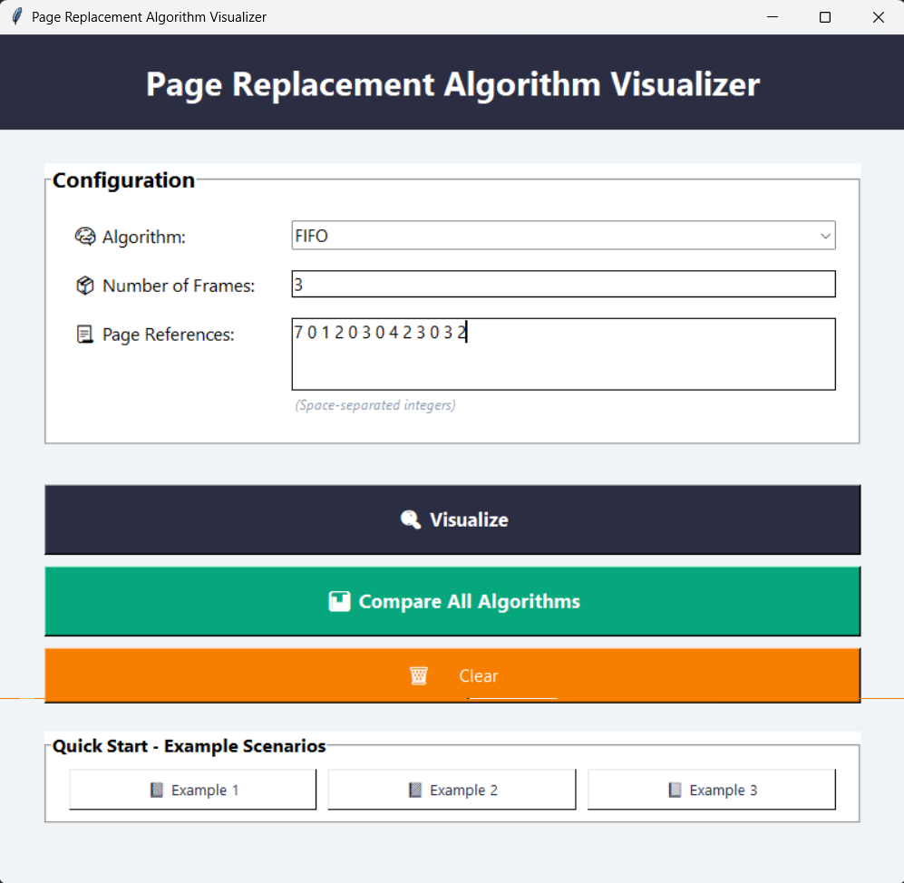
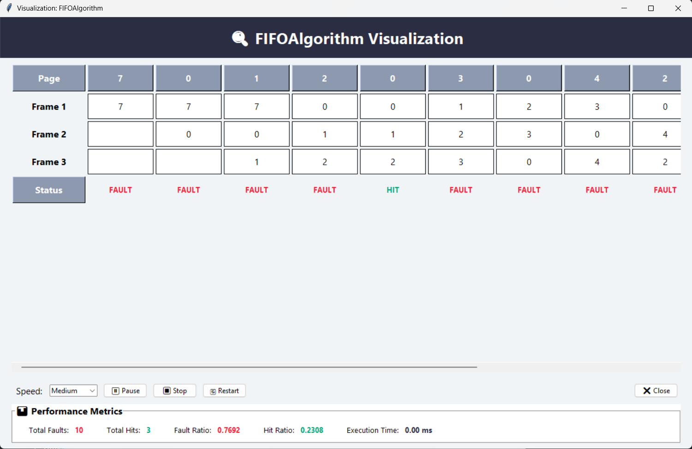
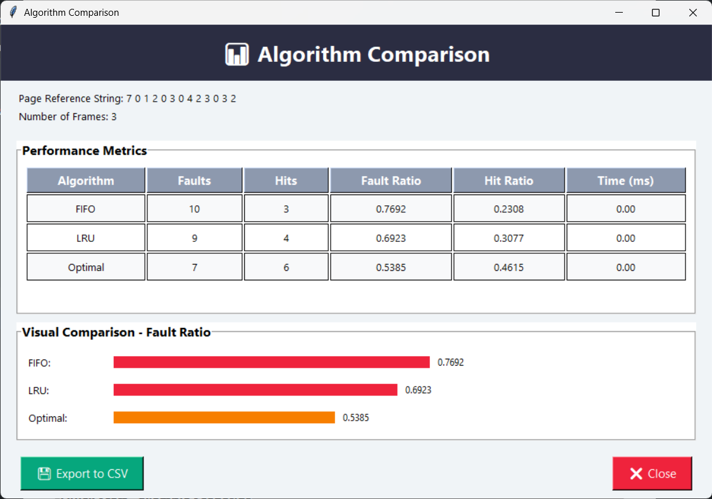

# Page Replacement Algorithm Visualizer

##  Demo Screenshots

### Main Interface


### Visualization


### Comparison View

# Modular Structure - Page Replacement Visualizer

## 📁 Project Structure

```
Page Fault/
├── constants.py        # Constants, enums, configuration (~35 lines)
├── models.py           # Data classes (~20 lines)
├── algorithms.py       # Algorithm implementations (~200 lines)
├── controllers.py      # Animation controller (~60 lines)
├── windows.py          # Visualization windows (~530 lines)
├── app.py              # Main application class (~280 lines)
├── main.py             # Entry point (~30 lines)
└── page.py             # Original monolithic file (backup)
```

**Total:** ~1,155 lines split into 7 focused modules

---

## 🎯 Module Responsibilities

### 1. **constants.py** (35 lines)
**Purpose:** Centralized configuration and constants

**Contains:**
- `AnimationSpeed` enum (SLOW, MEDIUM, FAST, INSTANT)
- `COLORS` dictionary (color scheme)
- `FONT_FAMILY` configuration
- `MAX_FRAMES` and `MAX_PAGES` limits

**Dependencies:** None

**Used by:** All modules

---

### 2. **models.py** (20 lines)
**Purpose:** Data structures

**Contains:**
- `PageFaultResult` dataclass

**Dependencies:** None

**Used by:** algorithms.py, windows.py

---

### 3. **algorithms.py** (200 lines)
**Purpose:** Page replacement algorithm implementations

**Contains:**
- `PageReplacementAlgorithm` (base class)
- `FIFOAlgorithm`
- `LRUAlgorithm`
- `OptimalAlgorithm`

**Dependencies:** 
- models.py (for PageFaultResult)
- time, collections.deque

**Used by:** app.py

**Key Features:**
- Pure algorithm logic, no GUI code
- Easy to add new algorithms
- Testable in isolation

---

### 4. **controllers.py** (60 lines)
**Purpose:** Animation state management

**Contains:**
- `AnimationController` class

**Dependencies:**
- constants.py (for AnimationSpeed)
- time

**Used by:** app.py, windows.py

**Key Features:**
- Pause/Resume/Stop/Restart
- Speed control
- State management

---

### 5. **window.py** (530 lines)
**Purpose:** Visualization user interfaces

**Contains:**
- `VisualizationWindow` - Single algorithm visualization
- `ComparisonWindow` - Multi-algorithm comparison

**Dependencies:**
- constants.py (colors, fonts)
- models.py (PageFaultResult)
- controllers.py (AnimationController)
- tkinter, csv

**Used by:** app.py

**Key Features:**
- Scrollable animation
- Live metrics
- CSV export
- Bar charts

---

### 6. **app.py** (280 lines)
**Purpose:** Main application window and logic

**Contains:**
- `PageReplacementApp` class

**Dependencies:**
- All other modules
- tkinter

**Used by:** main.py

**Key Features:**
- Input validation
- Configuration UI
- Preset examples
- Algorithm execution

---

### 7. **main.py** (30 lines)
**Purpose:** Application entry point

**Contains:**
- `main()` function
- Documentation

**Dependencies:**
- app.py

**Usage:**
```bash
python main.py
```

---

## 🔄 Dependency Graph

```
main.py
  └── app.py
       ├── constants.py
       ├── controllers.py
       │    ├── constants.py
       │    └── time
       ├── algorithms.py
       │    ├── models.py
       │    ├── time
       │    └── collections
       └── windows.py
            ├── constants.py
            ├── models.py
            ├── controllers.py
            ├── tkinter
            └── csv

Core Dependencies:
- constants.py: No dependencies (base level)
- models.py: No dependencies (base level)
```

---

## 🚀 Usage

### Running the Application
```bash
# Standard way
python main.py

# Or directly
python -m main
```

### Importing Individual Modules
```python
# Use just the algorithms
from algorithms import FIFOAlgorithm, LRUAlgorithm

pages = [1, 2, 3, 1, 4, 2]
algo = FIFOAlgorithm(pages, num_frames=3)
result = algo.execute()
print(f"Faults: {result.total_faults}")
```

### Adding a New Algorithm
```python
# In algorithms.py
class LFUAlgorithm(PageReplacementAlgorithm):
    """Least Frequently Used algorithm"""
    
    def execute(self) -> PageFaultResult:
        # Your implementation
        pass
```

Then update app.py algorithm dictionary:
```python
algo_class = {
    'FIFO': FIFOAlgorithm,
    'LRU': LRUAlgorithm,
    'Optimal': OptimalAlgorithm,
    'LFU': LFUAlgorithm,  # Add this
}
```

